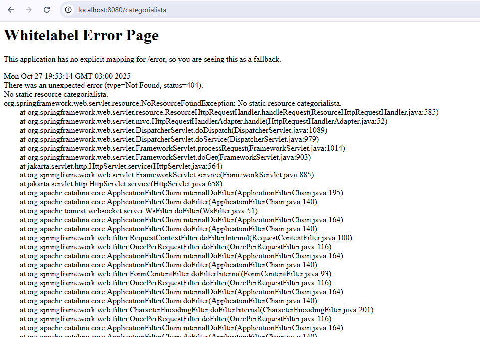

# 🐞 Relato de Bug

**Projeto:**  
**Aluno que encontrou: Matheus**  
**Aluno dona do projeto: Carlos**  
**Severidade: Crítica**    
**Componente / Tela: Tela de categoria, onde aparece a lista**  

## Passos para reproduzir
1. Entrar no sistema
2. **Clicar em Categoria na header**

### Resultado obtido

### Resultado esperado
Ao clicar no botão, deveria aparecer a lista de categorias, onde teria nelas botão de excluir e atualizar e um botão para cadastrar categoria.

## Hipótese de causa-raiz
Falta da criação da parte de categorias.

## Evidência / Print

---
**Status: Aberto**
